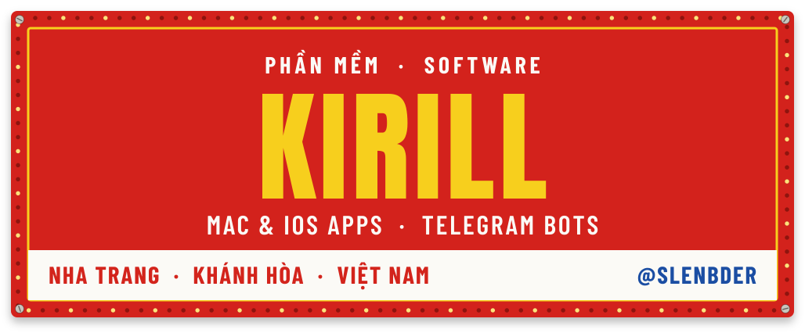
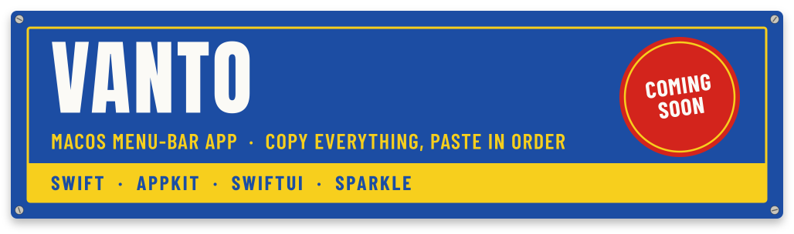
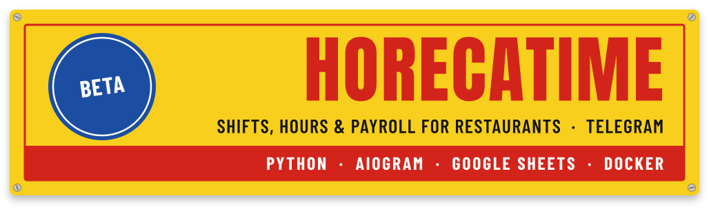
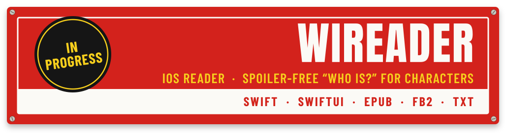
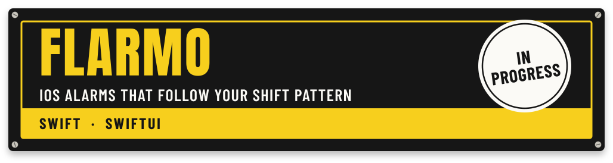
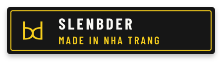

  

  
  
  

  I build small, finished pieces of software from Nha Trang: native apps for Mac and iPhone,
  and Telegram bots that quietly do a job for restaurants and local businesses.

 

 

  

